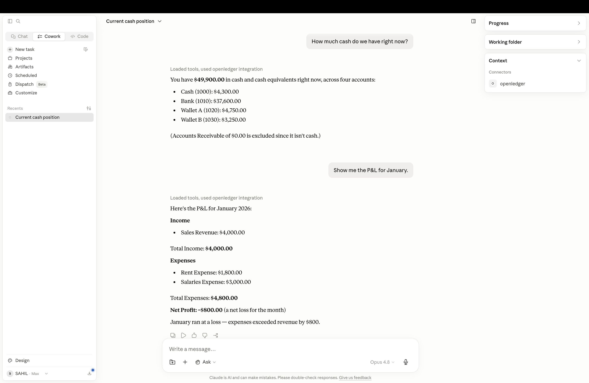

# OpenLedger in Claude — live demo

This is OpenLedger running as an MCP connector inside **Claude (Cowork)**. Claude
loads the `openledger` tools and answers plain-English accounting questions by
querying the live ledger — no SQL, no manual lookups.

The numbers below come straight from the seeded ledger, and they match the test
suite exactly (`scripts/smoke_test.py` and `tests/`), so this is real
end-to-end proof the integration works — not a mock-up.

---

## What was asked (and what OpenLedger answered)

> **You:** How much cash do we have right now?

> **Claude (via the `openledger` connector):**
> You have **$49,900.00** in cash and cash equivalents right now, across four accounts:
> - Cash (1000): $4,300.00
> - Bank (1010): $37,600.00
> - Wallet A (1020): $4,750.00
> - Wallet B (1030): $3,250.00
>
> (Accounts Receivable of $0.00 is excluded since it isn't cash.)

> **You:** Show me the P&L for January.

> **Claude (via the `openledger` connector):**
> Here's the P&L for January 2026:
>
> **Income**
> - Sales Revenue: $4,000.00
>
> Total Income: **$4,000.00**
>
> **Expenses**
> - Rent Expense: $1,800.00
> - Salaries Expense: $3,000.00
>
> Total Expenses: **$4,800.00**
>
> **Net Profit: −$800.00** (a net loss for the month)

---

## Why this confirms it works

| Claim in the demo | Where it's verified in the repo |
|---|---|
| Cash position **$49,900** across four accounts | `get_balance_sheet` / `scripts/smoke_test.py` (total assets $49,900) |
| January P&L: income $4,000, expenses $4,800, **net −$800** | `tests/test_ledger.py::test_profit_loss_values_for_january` |
| Tool calls go through the `openledger` MCP connector | the **Context → Connectors → openledger** panel in the screenshot |

To reproduce locally, follow [claude-connector.md](claude-connector.md) to connect
the server, then ask Claude the same questions.
